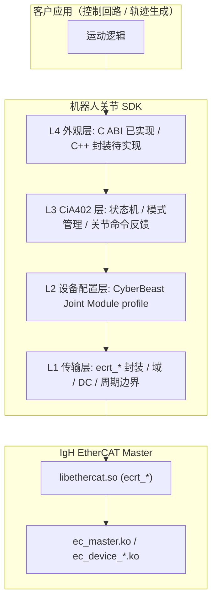
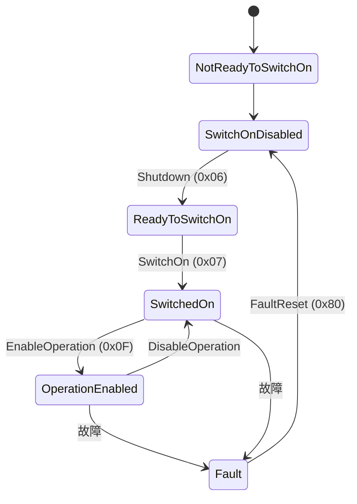
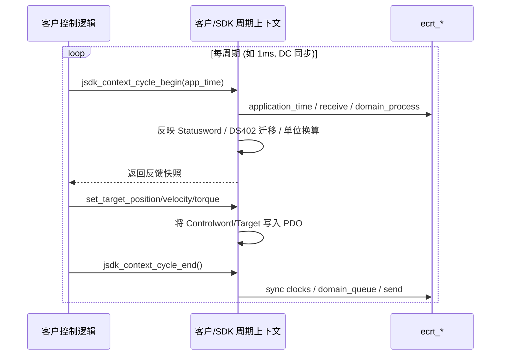

# 机器人关节 EtherCAT SDK — 架构设计文档

> 版本：v0.4（异步 SDO、故障诊断、单位换算已实现；多轴示例待验证）
> 状态：CSP/CSV/CST 三模式实物验证通过；PDO padding bug 已修复；ESI 动态加载可用；异步 SDO 读写、故障诊断闭环（自动读取 0x603F/0x1001/0x203F/0x203E）、单位换算（指令单位 ↔ rad/rad·s⁻¹/N·m + 位置展开）均已实现并交付示例；下一阶段为多轴同步验证、L4 C++ 外观层、集成文档与打包。
> 基础平台：IgH EtherCAT Master（用户空间 `libethercat.so` / `ecrt_*` API）
> 目标：为客户提供一套可集成进其 EtherCAT 主站系统的 SDK，快速、安全地通过 CiA402 协议与本公司机器人关节交互。

---

## 0. 文档目的与读者

本文档定义 SDK 的整体架构、分层职责、实时模型、配置数据模型与交付方式，并记录当前已落地的 PoC 与 L1/L2/L3 SDK 实现状态。

- **读者**：SDK 研发人员（内部）、集成客户的系统架构师（外部摘要版）。
- **范围**：架构与接口契约设计、守护兽关节设备 profile、当前实现状态与后续路线。CSP/CSV/CST 三模式 + 异步 SDO + 故障诊断 + 单位换算已通过实物验证；多轴示例、L4 C++ 外观层、集成文档与打包为下一阶段重点。

---

## 1. 背景与约束

| 项目 | 内容 |
|------|------|
| 业务 | 公司研发并销售基于 EtherCAT 总线的机器人关节 |
| 关节协议 | 以 **CiA402（CANopen over EtherCAT / CoE）** 驱动器子协议为主 |
| SDK 角色 | 封装 CiA402 状态机与报文细节，让客户"几行代码即可驱动关节" |
| 运行基座 | IgH EtherCAT Master：内核模块 `ec_master.ko` + 用户库 `libethercat.so`（`ecrt_*`） |
| 交付对象 | 客户的 EtherCAT 主站应用 |

### 1.1 关键事实（来自对 IgH 源码的核查）

- IgH 仓库**不包含任何 CiA402 设备子协议实现**（在 `master/`、`lib/`、`tool/`、`examples/`、`include/` 中均无 `0x6040`/controlword/statusword 等引用）。IgH 只提供**与设备子协议无关**的原始 CoE / PDO / SDO 机制。
- 因此 CiA402 抽象层需由本 SDK **从零构建**，这也是本 SDK 的核心价值所在。

### 1.2 IgH 提供的能力基线（SDK 的依赖面）

- **生命周期**：`ecrt_request_master` → `ecrt_master_create_domain` → `ecrt_master_slave_config` → `ecrt_slave_config_pdos` → `ecrt_domain_reg_pdo_entry_list` → `ecrt_master_activate` → 周期 `receive/process/queue/send`。
- **配置期 SDO**（激活前，idle/blocking）：`ecrt_slave_config_sdo8/16/32`、`ecrt_slave_config_complete_sdo`。
- **运行期异步 SDO**（激活后，rt_safe）：`ecrt_slave_config_create_sdo_request` + `ecrt_sdo_request_read/write/state/data`，**不阻塞周期**。
- **状态查询**（rt_safe）：`ecrt_master_state`、`ecrt_domain_state`、`ecrt_slave_config_state`。
- **数据读写宏**：`EC_READ_U8/16/32`、`EC_WRITE_U8/16/32`（处理字节序）。
- 参考调用顺序见 [examples/user/main.c](../../examples/user/main.c)；实时上下文约束见 [master/api_usage_notes.md](../../master/api_usage_notes.md)。

---

## 2. 设计原则

1. **实时边界显式分离**：配置期 API（idle/blocking，可阻塞）与周期期 API（rt_safe，禁止 sleep/malloc/锁）在类型与接口上区分，避免误用。
2. **CiA402 状态机完全隐藏**：客户只调用 `enable()` / `set_mode()` / `set_target_*()`；Controlword(0x6040)/Statusword(0x6041) 的状态迁移由 SDK 内部自动完成。
3. **设备描述数据化**：每种关节型号的 PDO 映射、SDO 初始化、电子齿轮/分辨率以"设备配置（device profile）"形式声明，新增机型尽量**不改 SDK 本体**。
4. **稳定 C ABI + 可选 C++ 外观**：核心导出稳定的 C ABI，便于在 C/C++、各类 RTOS、PREEMPT_RT / Xenomai / RTAI 环境中集成；其上提供 C++ 头文件薄封装提升易用性。
5. **周期/非周期分离**：高频指令与反馈走 PDO；参数配置与诊断走 SDO（配置期或运行期异步），二者在 API 层面清晰区分。

---

## 3. 分层架构



### 3.1 L1 — 传输层（IgH 抽象）

封装 IgH 完整生命周期，向上隐藏 `ecrt_*` 细节。

- **核心句柄** `jsdk_context`：持有 `ec_master_t*`、`ec_domain_t*`、process-data 指针与域偏移表。
- **两阶段以类型区分**：
  - 配置阶段 API（仅激活前可用）：申请主站、配置从站、注册 PDO、写配置 SDO。
  - 周期阶段 API（激活后、rt_safe）：`jsdk_context_cycle_begin()` / `jsdk_context_cycle_end()`。
- 维护每个 PDO 条目的 `offset` / `bit_position`，对上层以**逻辑对象名**（如 `target_position`）访问，而非裸偏移。
- 统一封装 `ecrt_master_state` / `ecrt_domain_state` 的健康监测（响应从站数、AL 状态、工作计数器 WKC）。

### 3.2 L2 — 设备配置层（声明式）

将不同关节型号的差异**数据化**，而非写死在代码中。

```c
// 当前实现中的 profile 关键字段（见 sdk/src/internal.h）
typedef struct {
    const char *name;
    uint32_t vendor_id;
    uint32_t product_code;
    uint32_t revision_no;
    uint16_t dc_assign_activate;
    uint32_t min_cycle_ns;
    int8_t mode_csp;
    int8_t mode_csv;
    int8_t mode_cst;
    const ec_sync_info_t *syncs;
} jsdk_joint_profile_t;
```

- 新增机型 = 新增一个 profile（如需免重编译，可从 ESI/外部文件加载）。
- profile 通过注册表按 `(vendor_id, product_code)` 或型号名检索。
- 当前已实现 profile：`CyberBeast Joint Module`，源码见 [docs/joint-sdk/sdk/src/profile_cyberbeast_joint_module.c](sdk/src/profile_cyberbeast_joint_module.c)。
- 单位换算、参数 SDO、故障码字典将在后续扩展到 profile 中。

### 3.3 L3 — CiA402 层（核心价值）

每个轴内置：

- **DS402 状态机**：自动完成 `Switch on disabled → Ready to switch on → Switched on → Operation enabled` 迁移，依据 Statusword(0x6041) 监测、驱动 Controlword(0x6040)。检测 `Fault reaction active → Fault` 并提供 `fault_reset()`。
- **运行模式抽象**（0x6060/0x6061）：PP（轮廓位置）/ PV（轮廓速度）/ **CSP（周期同步位置）/ CSV / CST（周期同步力矩）**。机器人关节以 CSP/CSV/CST 为一等公民。
- **对象访问分流**：周期对象（PDO）与非周期对象（SDO request）使用不同 API。
- **单位换算**：编码器计数 ↔ 物理量，系数取自 profile 的电子齿轮比/分辨率。当前初版 SDK 仍直接使用指令单位，物理量换算待补充《CANOpen 补充手册》公式后实现。



### 3.4 L4 — 外观层（客户 API）

当前已实现稳定 C ABI，客户可以把 SDK 嵌入自己的实时循环。C++ `JointGroup` / `Joint` 薄封装仍作为后续计划。

```c
jsdk_context_config_default(&ctx_config);
ctx = jsdk_context_create(&ctx_config);

joint_config.alias = 0;
joint_config.position = 0;
joint_config.profile_name = JSDK_PROFILE_CYBERBEAST_JOINT_MODULE;

jsdk_context_add_joint(ctx, &joint_config, &joint);
jsdk_context_activate(ctx);
jsdk_joint_request_enable(joint, JSDK_MODE_CSP);

while (running) {
    jsdk_context_cycle_begin(ctx, app_time_ns);
    jsdk_joint_get_feedback(joint, &feedback);
    jsdk_joint_set_target_position(joint, target);
    jsdk_context_cycle_end(ctx);
}
```

---

## 4. 实时线程模型

核心 SDK **不强行拥有 RT 线程**，默认采用形态 B：嵌入客户已有实时循环。客户每周期在固定时刻调用 `jsdk_context_cycle_begin()`，完成控制计算后调用 `jsdk_context_cycle_end()`。形态 A（SDK 自带 RT 线程 + 回调）可在 L4 外观层中追加。



- **形态 B（已实现）**：客户已有 RT 循环时，每周期调用 `jsdk_context_cycle_begin()` / `jsdk_context_cycle_end()`，SDK 不另起线程，对客户系统侵入最小。
- **形态 A（待实现）**：SDK 自带 RT 线程和 `user_cycle_cb`，适合没有现成实时循环的客户样例或快速验证。
- **RT 安全**（遵循 [master/api_usage_notes.md](../../master/api_usage_notes.md)）：周期上下文禁止 sleep/malloc/加锁；SDO 走异步请求（`ecrt_sdo_request_*` + 状态轮询），不阻塞周期；跨线程数据用无锁环/双缓冲。

---

## 5. 周期（PDO）与非周期（SDO）数据分流

| 数据 | 通道 | API 示例 |
|------|------|---------|
| 目标位置/速度/力矩、Controlword | **PDO（周期）** | `jsdk_joint_set_target_*()` |
| 实际位置/速度/力矩、Statusword | **PDO（周期）** | `jsdk_joint_get_feedback()` |
| 电子齿轮、模式切换、PID/限值 | **启动 SDO** | profile 的 `sdo_init` |
| 运行中参数调整 / 诊断读取 | **异步 SDO** | `j.write_param()/read_param()`（非阻塞，完成通知） |

> 当前初版已实现 PDO 周期读写、启动时模式 SDO（0x6060=CSP）和 DC 配置；运行期异步 SDO 参数/诊断线程仍待实现。

---

## 6. 错误模型与诊断

- 返回码 + 详情查询（`jsdk_context_last_error()`）；RT 路径**不抛异常**。
- 已实现基础分级诊断：总线级（WKC、链路、响应从站数、AL 状态）、从站级（online/operational/AL state）、轴级（Statusword、模式显示、实际位置/速度/力矩、CiA402 状态）。
- 已实现 `jsdk_joint_request_fault_reset()`；`on_fault(axis, code)` 回调、0x603F/0x1001/0x203E/0x203F 详细 SDO 读取仍待实现。

---

## 7. 配置数据模型（profile）

profile 是 SDK 与具体关节型号之间的契约，至少包含：

1. **身份**：`vendor_id` / `product_code`（用于 `ecrt_master_slave_config` 校验）。
2. **SM/PDO 映射**：`ec_sync_info_t[]`（RxPDO=输出，TxPDO=输入），见 [examples/user/main.c](../../examples/user/main.c) 的 `el3102_syncs` 写法。
3. **PDO 条目登记**：`ec_pdo_entry_reg_t[]` 用于 `ecrt_domain_reg_pdo_entry_list` 取偏移。
4. **启动 SDO 序列**：模式默认值、电子齿轮、软限位、电流/速度限值等。
5. **DC 配置**：是否启用 DC、周期、shift time。
6. **单位换算**：计数/圈、减速比、力矩常数 → rad、rad/s、N·m。

> CyberBeast Joint Module 的静态字段已由 ESI 文件和协议手册固化到 L2 profile；单位换算、详细故障码、参数 SDO 仍需后续扩展。

---

## 8. 交付与 ABI 策略

- **核心 = 稳定 C ABI**（`joint_sdk.h`），不依赖客户编译器/语言；版本校验需覆盖 IgH 的 `EC_IOCTL_VERSION_MAGIC` 兼容性。
- **C++ 头文件薄封装**计划随包提供，当前尚未实现。
- **依赖隔离**：在 L1 用薄 shim 收拢 `ecrt_*` 调用以吸收 IgH 版本差异，并在文档中标注支持的 IgH 版本范围。
- **当前交付物**：`libjointsdk.a` / `libjointsdk.so` 构建规则 + C ABI 头文件 + 守护兽 profile + 全模式 CSP/CSV/CST 示例 + 异步 SDO / 故障诊断 / 物理单位示例。多轴同步、C++ 外观层、集成文档与打包仍待补齐。

---

## 9. 当前 SDK 目录结构

```
joint-sdk/
├── Makefile                 # 构建 libjointsdk.a / libjointsdk.so / 全部示例
├── include/joint_sdk/
│   ├── joint_sdk.h          # C ABI（已实现）
│   └── cia402.h             # DS402 常量 / 状态定义（已实现）
├── src/
│   ├── transport.c          # L1: ecrt_* 封装, domain, DC, 周期边界, ESI 加载,
│   │                          异步 SDO, 故障诊断, 单位换算
│   ├── esi_parser.h         # ESI XML 解析器内部头文件
│   ├── esi_parser.c         # 零依赖 ESI XML 解析器（方案 B）
│   ├── profile_cyberbeast_joint_module.c # L2: 守护兽静态 profile（向后兼容）
│   ├── cia402.c             # L3: DS402 状态机
│   └── internal.h           # SDK 内部结构
├── ECAT_CIA402.xml          # 守护兽 ESI 文件（动态加载用）
└── examples/
    ├── csp_single_sdk.c     # 内置 profile 单轴 CSP
    ├── diag_csp_single.c    # CSP 诊断（--hold, ESI 加载）
    ├── diag_csv_single.c    # CSV 诊断
    ├── diag_cst_single.c    # CST 诊断
    ├── sdo_diag.c           # 异步 SDO 读写 + --tune 自动调增益
    ├── fault_diag.c         # 故障诊断（回调 + 同步查询）
    ├── phys_csp_single.c    # 物理单位 CSP（rad/rad·s⁻¹/N·m）
    └── multi_axis_csp.c     # 多轴 CSP（2~N 轴同步）
```

---

## 10. 分阶段实施路线

1. **✅ 已完成：PoC**。基于 [examples/user/main.c](../../examples/user/main.c) 与 [docs/joint-sdk/poc/csp_single.c](poc/csp_single.c)，单轴 CSP 已在目标 IgH 主站环境验证成功。
2. **✅ 已完成：L1/L2/L3 初版 SDK**。L1 传输层、L2 守护兽 profile + ESI 动态加载、L3 DS402 状态机已拆分到 [docs/joint-sdk/sdk](sdk)。
3. **✅ 已完成：CSP/CSV/CST 三模式联调**。使用诊断示例（`diag_csp_single` / `diag_csv_single` / `diag_cst_single`）验证三模式链路通；修复了 PDO padding 条目偏移 bug。
4. **✅ 已完成：异步 SDO + 故障诊断闭环 + 单位换算**。运行期非阻塞 SDO 读写、自动故障码读取与回调、指令单位 ↔ rad/rad·s⁻¹/N·m 双向转换 + 位置展开，均已实现并附带 `sdo_diag` / `fault_diag` / `phys_csp_single` 示例。
5. **🔧 进行中：多轴同步示例 + 文档更新**。多轴 domain 布局验证、DC 参考时钟、单轴故障隔离；架构文档同步至 v0.4。
6. **待实现：L4 C++ 外观层 + 集成文档与打包**。`JointGroup`/`Joint` C++ 封装、`make install`、pkg-config、客户集成指南。

---

## 11. 设备规格（来自《守护兽驱动 EtherCAT 协议手册》）

> 本节内容依据「守护兽驱动」（CyberBeast，底层固件基于 ODrive）协议手册整理，作为 L2 设备配置（profile）的依据。ESI 文件：`ECAT_CIA402.xml`（`https://bl.cyberbeast.cn/actuator/ECAT_CIA402.xml`）。

### 11.1 总体特性

| 项目 | 规格 |
|------|------|
| 子协议 | CiA402（CoE） |
| 同步方式 | **强制 DC 分布式时钟**，Sync0 周期 = 通讯周期 |
| 物理层 | 100 Mbit/s（100Base-TX） |
| 支持模式 | **CSP / CSV / CST**（仅这三种，无 PP/PV/HM 周期外模式经 EtherCAT 暴露；0x6502 = 0x761） |
| 最小 DC 周期 | 1 轴≈41.1 µs，5 轴≈46.5 µs；SYNC0 最小 31.2 µs（0x9A0 下限）；实验室数据 |
| PDO 重映射 | **不支持**用户自定义映射对象；映射固定，仅 PDO **分配** 可在 PRE-OP 经 1C12/1C13 选择 |
| 关键约束 | PDO 分配只能在 **PRE-OP** 写；参数不存 EEPROM，**每次上电须重配**；必须保证 SYNC0 在 SM2 事件之后，推荐 **shift time = 周期 / 4** |

### 11.2 固定 PDO 映射（位长来自 `0xIIIISSLL` 编码）

RPDO（主站→从站，输出）三选一，经 0x1C12:01 选择：

| PDO | 对象（索引:子, 位长） | 适用模式 |
|-----|----------------------|---------|
| **0x1600**（全功能，6 项→5 个对象） | 0x6040:0 控制字(16)、0x607A:0 目标位置(32)、0x60FF:0 目标速度(32)、0x6071:0 目标转矩(16)、0x6060:0 模式(8) | CSP/CSV/CST 通用 |
| 0x1601 | 0x6040(16)、0x607A 目标位置(32) | 纯 CSP |
| 0x1602 | 0x6040(16)、0x60FF 目标速度(32) | 纯 CSV |

TPDO（从站→主站，输入）三选一，经 0x1C13:01 选择：

| PDO | 对象（索引:子, 位长） |
|-----|----------------------|
| **0x1A00**（全功能） | 0x6041:0 状态字(16)、0x6064:0 实际位置(32)、0x606C:0 实际转速(32)、0x6077:0 实际转矩(16)、0x6061:0 模式显示(8) |
| 0x1A01 | 0x6041(16)、0x6064 实际位置(32) |
| 0x1A02 | 0x6041(16)、0x606C 实际转速(32) |

> **SDK 默认选用 0x1600 / 0x1A00**（全功能），一套映射即可覆盖 CSP/CSV/CST 与三种反馈，运行时只切 0x6060 模式即可，无需改 PDO 分配。
> ESI 已确认 0x1600/0x1A00 各含 **5 个有效对象 + 1 个 8 位填充**（见 11.7）；手册「对象组 1000h 表」记 5、「概述表」记 6，以 ESI 的 5 个有效对象为准。

### 11.3 PDO 配置流程（PRE-OP 下，经配置期 SDO）

1. 清零：对 0x1C12:00 与 0x1C13:00 写 0；
2. 写分配：0x1C12:01 ← 0x1600，0x1C13:01 ← 0x1A00（只能取 0x1600–0x1602 / 0x1A00–0x1A02）；
3. 写数量：0x1C12:00 ← 1，0x1C13:00 ← 1。

> 非 PRE-OP 修改、或写入允许范围外的值，从站返回 SDO 故障码。

### 11.4 关键对象（profile 与 API 用到的）

| 索引:子 | 名称 | 类型/单位 | 用途 |
|---------|------|----------|------|
| 0x6040 / 0x6041 | 控制字 / 状态字 | U16 | DS402 状态机 |
| 0x6060 / 0x6061 | 模式选择 / 显示 | I8 | 8=CSP, 9=CSV, 10=CST（CiA402 标准编码，待联调确认） |
| 0x607A / 0x6064 | 目标位置 / 实际位置 | I32 指令单位 | CSP |
| 0x60FF / 0x606C | 目标速度 / 实际转速 | I32 指令单位 | CSV / 反馈 |
| 0x6071 / 0x6077 | 目标转矩 / 实际转矩 | I16，0.1% 额定转矩 | CST / 反馈 |
| 0x6072 / 0x6073 | 最大转矩 / 最大电流 | U16，0.1% | 限值 |
| 0x6075 / 0x6076 | 额定电流 / 额定转矩 | U32，0.1% | 单位换算基准 |
| 0x607D | 软件位置限制（:1 min, :2 max） | I32 指令单位 | 软限位 |
| 0x6080 | 最大电机速度 | U32 | 限值 |
| 0x608F:1/:2 | 编码器分辨率 / 电机转速 | U32 | **转换因子**（默认 16384） |
| 0x6091:1/:2 | 齿轮比（电机分辨率 / 负载轴分辨率） | U32 | **减速比换算** |
| 0x60C2:1/:2 | 插补时间（单位 / 索引） | U8/I8 | DC 周期匹配 |
| 0x603F / 0x1001 | 故障码 / 错误寄存器 | U16 / U8 | 故障分类 |
| 0x203F / 0x203E | 伺服故障码（低/高 32 位） | U32 | 厂商详细故障 |
| 0x1018:1/:2 | 厂商 ID / 产品编码 | U32 | `ecrt_master_slave_config` 校验；ESI 已确认为 vendor 0x000C0B00 / product 0x00080153 |
| 0x6502 | 支持的控制模式 | U32 = 0x761 | 能力位 |
| 0x2008 | 增益（速度/位置/电流环 PID，0.01） | U16 | 可选调参 |
| 0x200A | 故障与保护参数（温度/母线电流电压限值） | 混合 | 可选配置 |

### 11.5 单位换算（指令单位 ↔ 物理量）

- 帧内全部为**指令单位**，换算因子见《守护兽驱动 CANOpen 补充手册》（待补充其转换因子细节）。
- 关键依据：0x608F 编码器分辨率（默认 16384）、0x6091 齿轮比、0x6076 额定转矩（默认 10 N·m）、0x6075 额定电流（默认 10 A）。
- 转矩单位：0x6071/0x6077 为 **0.1% 额定转矩**（对应表另注 0x6071 为 0.001 N·m × 额定转矩，存在两种表述，**需联调核对**）。

### 11.6 故障处理

- 状态字 0x6041 Bit3=1 → 故障；读 0x603F 判 CiA402 标准码；0x1001 错误寄存器按位分类（电流/电压/温度/通信/402/厂商）。
- 0x603F = 0xFF00 表示厂商自定义故障，详情读 0x203F（低 32 位）+ 0x203E（高 32 位）。
- 通讯/AL 故障（如 0x001A 同步错误、0x001B SM 看门狗、0x0030 DC 配置无效、0x0036 Sync0 周期超界）会触发停机保护——SDK 需读取并上报 AL Status Code。
- SDK 提供 `on_fault(axis, error_register, code_603f, vendor_lo, vendor_hi)` 回调与 `fault_reset()`（控制字 0x80）。

### 11.7 ESI 文件（`ECAT_CIA402.xml`）确认的信息

经解析厂商 ESI 文件，以下信息已**确认**（用于 profile 与 PoC）：

| 项目 | 确认值 |
|------|--------|
| Vendor Name / **Vendor ID** | CyberBeast / **0x000C0B00** |
| Device Type / **Product Code** | CyberBeast Joint Module / **0x00080153**（RevisionNo 0x00000001；当前 ESI 设备类型字符串来自厂商 XML） |
| 设备组 | Robot_Joint_Actuator |
| Profile | CiA **402** |
| **SM 布局** | SM0=MBoxOut@0x1000, SM1=MBoxIn@0x1080, **SM2=Outputs(RxPDO), SM3=Inputs(TxPDO)** |
| Mailbox CoE | `SdoInfo=true, PdoAssign=true, PdoConfig=false, CompleteAccess=true, SegmentedSdo=true`（**PdoConfig=false → 印证不可改 PDO 映射**，仅可改分配） |
| **DC OpMode** | 提供 `Synchron`（AssignActivate=0x0）与 **`DC`（AssignActivate=0x300）**；Sync0/Sync1 CycleTime 默认 0（由主站设定） |
| **DC AssignActivate** | **0x300**（SDK 配置 DC 时使用此值） |
| 默认动态模块 | ModuleIdent **0x119800** = "csv,csp,cst - axis / dynamic switch between csp/csv/cst" → **0x1600 + 0x1A00 全功能映射，运行时切模式** |

**ESI 中的全功能 PDO（与手册一致，确认 SM 归属与对象顺序）：**

- **RxPDO 0x1600 @ SM2**：0x6040 控制字(16) → 0x607A 目标位置(32) → 0x60FF 目标速度(32) → 0x6071 目标转矩(16) → 0x6060 模式(8) → 8 位填充。
- **TxPDO 0x1A00 @ SM3**：0x6041 状态字(16) → 0x6064 实际位置(32) → 0x606C 实际转速(32) → 0x6077 实际转矩(16) → 0x6061 模式显示(8) → 8 位填充。

> 注意 ESI 在 5 个有效对象后各补 1 个 8 位填充项（Index=0），使 RxPDO/TxPDO 字节对齐。SDK 在 `ec_pdo_entry_info_t[]` 中需复现该填充。

### 11.8 仍需联调确认的点（标注 ⚠）

- [ ] 0x6060 模式编码值（按 CiA402 标准应为 **8=CSP / 9=CSV / 10=CST**，ESI/手册未直接给出数值，SDK 示例联调时以实物 SDO/反馈确认）。
- [ ] 0x6071/0x6077 转矩单位的确切定义（手册有 0.1% 额定转矩 vs 0.001 N·m×额定转矩两种表述）。
- [ ] 《CANOpen 补充手册》转换因子的完整公式（位置/速度指令单位 ↔ rad、rad/s）。
- [ ] 0x60C2 插补时间与所选 DC 周期的配置关系。
- [ ] 各从机数量下可稳定运行的最小 DC 周期（手册为实验室值，需现场标定）。

---

## 12. 已确认的设计决策

基于业务方答复（2026-06）与协议手册，固化如下决策：

| 编号 | 议题 | 决策 |
|------|------|------|
| D1 | 控制模式 | **同时一等支持 CSP / CSV / CST**；统一采用 0x1600/0x1A00 全功能 PDO，运行时仅切 0x6060，不改 PDO 分配。默认 CSP。 |
| D2 | 轴数 | 典型 1~10 轴，**最大不设硬上限**；架构按 N 轴可扩展设计（单 domain 容纳多轴 PDO，按 DC 周期表评估最小周期）。 |
| D3 | RT 环境 | 业务方未指定。**首选 PREEMPT_RT**（最通用、部署门槛低），同时在 L1 用薄 shim 隔离 `ecrt_*`，保留对 Xenomai/RTAI 的可移植性。文档标注三种环境的适配说明。 |
| D4 | 集成形态 | **两种都提供，默认形态 B（嵌入客户既有 RT 循环，`jsdk_context_cycle_begin()` / `jsdk_context_cycle_end()`）**——对客户已有主站系统侵入最小、最易落地；形态 A（SDK 自带 RT 线程 + 回调）作为可选便利封装。 |
| D5 | 总线范围 | **仅支持本公司关节**；profile 注册表按 (vendor_id, product_code) 校验，非本公司从站直接拒绝配置，简化测试面与责任边界。 |
| D6 | DC | **强制 DC**（设备仅支持 DC，ESI AssignActivate=**0x300**）；SDK 自动配置 SYNC0=周期、shift time=周期/4，并校验周期 ≥ 设备最小值（按轴数查表）。 |

---

## 13. 当前实现状态

| 模块/能力 | 状态 | 说明 |
|-----------|------|------|
| PoC 单轴 CSP | **✅ 已验证** | 旧 PoC 位于 [docs/joint-sdk/poc/csp_single.c](poc/csp_single.c)，已在目标 IgH 环境验证成功。 |
| 公共 C ABI | **✅ 已实现** | 头文件位于 [sdk/include/joint_sdk/joint_sdk.h](sdk/include/joint_sdk/joint_sdk.h)，提供 context、joint、周期 begin/end、命令、反馈、状态查询。 |
| L1 传输层 | **✅ 已实现** | [sdk/src/transport.c](sdk/src/transport.c) 封装 master/domain/slave config/PDO/DC/周期收发。已修复 PDO padding 条目偏移 bug。 |
| L2 设备 profile | **✅ 已实现** | [sdk/src/profile_cyberbeast_joint_module.c](sdk/src/profile_cyberbeast_joint_module.c) 内置静态 profile；同时支持 ESI XML 动态加载。 |
| L2 ESI XML 解析器 | **✅ 已实现** | [sdk/src/esi_parser.c](sdk/src/esi_parser.c) 零依赖 XML 解析，自动提取 vendor/product/PDO/SM/DC 构建 profile。支持 30+ 型号免重编译适配。 |
| L3 CiA402 状态机 | **✅ 已实现** | [sdk/src/cia402.c](sdk/src/cia402.c) 实现 enable/disable/fault reset 与状态解析。 |
| 单轴 CSP 示例 | **✅ 已验证** | [sdk/examples/csp_single_sdk.c](sdk/examples/csp_single_sdk.c) 内置 profile 路径。 |
| 诊断示例 CSP | **✅ 已验证** | [sdk/examples/diag_csp_single.c](sdk/examples/diag_csp_single.c) 支持 `--hold` 静止模式、正弦轨迹、ESI 动态加载。 |
| 诊断示例 CSV | **✅ 已验证** | [sdk/examples/diag_csv_single.c](sdk/examples/diag_csv_single.c) 周期同步速度，支持 `--hold`。 |
| 诊断示例 CST | **✅ 已验证** | [sdk/examples/diag_cst_single.c](sdk/examples/diag_cst_single.c) 周期同步力矩，支持 `--hold`。 |
| 构建脚本 | **✅ 已实现** | [sdk/Makefile](sdk/Makefile) 构建 `libjointsdk.a/.so` 和全部示例目标。 |
| **异步 SDO 读写** | **✅ 已实现** | [sdk/src/transport.c](src/transport.c) 封装 `ecrt_sdo_request_*`，每个 joint 最多 12 个句柄，rt_safe。示例：[sdo_diag.c](examples/sdo_diag.c)。 |
| **故障诊断闭环** | **✅ 已实现** | Statusword bit3 时自动 SDO 轮询 0x603F→0x1001→0x203F→0x203E，触发 `jsdk_fault_callback_t` 回调 + `jsdk_joint_get_fault_info()` 同步查询。示例：[fault_diag.c](examples/fault_diag.c)。 |
| **单位换算** | **✅ 已实现** | `jsdk_unit_scale_t` 系数计算 + 6 个物理量 API（rad/rad·s⁻¹/N·m）+ 16→32 bit 位置累计展开。示例：[phys_csp_single.c](examples/phys_csp_single.c)。 |
| **多轴同步示例** | **🔧 进行中** | 2~N 轴 CSP 同步，验证 domain 布局、DC 参考时钟、单轴故障隔离。[multi_axis_csp.c](examples/multi_axis_csp.c)。 |
| **L4 C++ 外观层 / 自带 RT 线程** | **🔧 待实现** | `JointGroup` / `Joint` 类封装，RAII 生命周期，回调式 RT 线程（形态 A）。 |
| 集成文档与打包 | **🔧 待实现** | `make install`、pkg-config、集成指南、API 参考。 |

---

## 14. 下一步

### 进行中：多轴同步验证

1. **多轴 CSP 示例**（`multi_axis_csp`）
   - 配置 2~N 个 joint 到同一 domain，依次 `add_joint` 不同 alias/position。
   - 验证多轴 PDO 偏移在 domain 内存中正确不重叠。
   - 验证 DC 参考时钟选择（首个带 DC 的从站自动成为参考时钟）。
   - 验证 WKC 按从站数正确增长。
   - 验证单轴故障（物理断线或拔电）后其他轴不受影响、WKC 减少、AL state 变化可检测。

### 待实现：L4 C++ 外观层

2. **`JointGroup` / `Joint` 封装**
   - `JointGroup` 构造 = 自动 create + add_joints，析构 = destroy。
   - `Joint` 语义化 API（`enable()` / `setTargetPosition()` / `actualPosition()`）。
   - 形态 A：`JointGroup::start()` 启动内置 RT 线程 + `std::function` 周期回调。

### 待实现：集成文档与打包

3. **集成指南** — 依赖安装、ESI 文件放置、最小示例、API 参考、故障排障。
4. **打包** — `make install`、`libjointsdk.so` / 头文件 / pkg-config。
