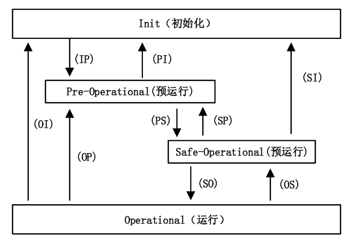
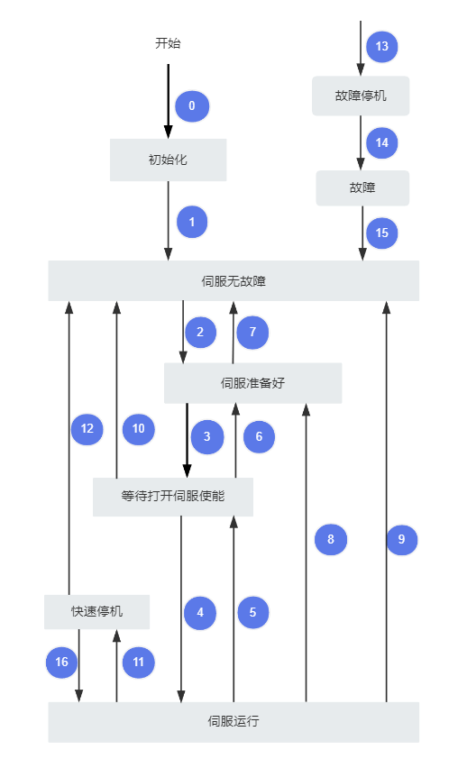

# 守护兽驱动ETHERCAT协议手册

# 概述

本驱动板的 ETHERCAT协议 遵循 CANOPEN的 CiA402 规范实现。本驱动板的EtherCAT的同步方式为DC分布式时钟。波特率100 Mbit/s（100Base\-TX）

## EtherCAT状态指示灯

常亮表示OP模式

0\.5s的频率闪烁表示SAFEOP模式

1s的频率闪烁表示PREOP模式

## 可支持的控制模式

EtherCAT下可支持的控制模式，当前只有周期同步位置模式（CSP），周期同步力矩模式（CST）和周期同步速度模式（CSV）。

## 支持的通讯周期

EtherCAT 支持Sync0（DC同步）模式。使用DC机制的时候，当EtherCAT网络中存在多个驱动器从节点的时候，可以使所有节点共享同一系统时钟，从站基于同一时钟产生同步信号，从而实现多轴系统的高精度控制。

主站通过设定Sync0信号的输出周期，来决定通讯周期，使用DC同步时Sync0的周期就是通讯周期。目前支持的DC同步时间如下，以下数据为实验室数据。

|从机个数|1|2|3|4|5|
|---|---|---|---|---|---|
|最小DC周期时间\(us\)|41\.1|41\.7|42\.9|43\.8|46\.5|

在进行EtherCAT主从通讯测试时，比较容易在DC配置出现错误，特别是使用到从站DC模式时，有时会出现代码为0x1A的“同步错误”。在应用层，每个从站实时监视从ESC收到的同步SYNC信号。假如检测到同步错误，从站会进入SAFE\-OP状态并产生对应的应用层状态码，主站可以通过非周期命令读取这一状态码。

**可能引起同步错误的原因**

1\.主站周期时间/同步信号的错误配置

2\.不再收到第一个DC从站ESC发送的SYNC信号

3\.主站发送数据帧时存在较大的抖动，导致数据帧在从站收到SYNC信号之后才到达从站

解决此错误，必须保证SYNC0必须在SM2事件之后。

如果使用的是TWINCAT, 通过设置Shit time\(SYNC0延时启动\)时间可以改变SM2与SYNC0的间隔时间，给从站进行数据拷贝留出更多的时间，保证数据全部更新。

推荐设置shit time为周期的四分之一。

# COE协议

## EtherCAT状态机

驱动器作为从站设备支持以下4种基本状态，主站与从站通过状态机执行状态切换，同时在OP状态下所有SDO，TXPDO，RXPDO全部有效 。故在OP状态下执行各种控制

## 伺服状态

使用本驱动器必须按照CiA402协议规定的流程引导伺服驱动器，伺服驱动器才可运行于指定的状态。

控制字与状态切换解释如下表：

## 转换因子

注意EtherCAT数据帧的单位为指令单位，如果需要转为用户单位，可参照[ 守护兽驱动CANOpen补充手册](https://bcnyljrhe70u.feishu.cn/wiki/RkxswgglNiX2mckH9CdcVNmQnXe)的转换因子板块。

## 周期同步位置模式（CSP）

周期同步位置模式下，上位控制器完成位置指令规划，然后将规划好的目标位置周期性地发送给伺服驱动 

器， 位置、速度、转矩控制由伺服驱动器内部完成。

## 周期同步速度模式（CSV）

周期同步速度模式下，上位控制器将计算好的目标速度周期性同步地发送给伺服驱动器，速度、转矩调节由 

伺服内部执行。

## 周期同步转矩模式（CST\)

周期同步转矩模式下，上位控制器将计算好的目标转矩周期性同步的发送给伺服驱动器，转矩调节由伺服内部执行。

## 通信数据帧结构

### 过程数据

EtherCAT实时数据传输通过 过程数据（Process data Object）实现。根据数据传输方向，PDO可分为RPDO和TPDO，RPDO将主站数据传送到从站，TPDO将从站数据反馈至主站。

目前不支持用户变更PDO映射对象。当前PDO的分配与映射为可变的PDO分配对象和固定的PDO映射对象。

#### 固定PDO映射

PDO 映射用于建立对象字典与PDO 的映射关系。1600h\~17FFh 为RPDO，1A00h\~1BFFh 为TPDO，目前本驱动器只支持1600h\~1602h，1A00h\~1A02h，如下：

|索引 |子索引 |名称|可访问性|能否映射|数据类型|单位|数据范围|出厂设定|
|---|---|---|---|---|---|---|---|---|
|1600h|0h|RPDO1 映射参数|RW|NO|Uint8|\-|Uint8|6|
||1h|RPDO1 映射对象 1|RW|NO|Uint32|\-|Uint32|0X60400010|
||2h|RPDO1 映射对象 2|RW|NO|Uint32|\-|Uint32|0X607A0020|
||3h|RPDO1 映射对象 3|RW|NO|Uint32|\-|Uint32|0X60FF0020|
||4h|RPDO1 映射对象 3|RW|NO|Uint32|\-|Uint32|0X60710010|
||5h|RPDO1 映射对象 3|RW|NO|Uint32|\-|Uint32|0X60600008|
|1601h |0h|RPDO2 映射参数|RW|NO|Uint8|\-|Uint8|3|
||1h|RPDO2 映射对象 1|RW|NO|Uint32|\-|Uint32|0x60400010|
||2h|RPDO2 映射对象 2|RW|NO|Uint32|\-|Uint32|0x607A0020|
|1602h |0h|RPDO3 映射参数|RW|NO|Uint8|\-|Uint8|3|
||1h|RPDO3 映射对象 1|RW|NO|Uint32|\-|Uint32|0x60400010|
||2h|RPDO3 映射对象 2|RW|NO|Uint32|\-|Uint32|0x60FF0020|
|1A00h|0h|TPDO1 映射参数|RO|NO|Uint8|\-|Uint8|6|
||1h|TPDO1 的映射对象 1|RW|NO|Uint32|\-|Uint32|0X60410010|
||2h|TPDO1 的映射对象 2|RW|NO|Uint32|\-|Uint32|0X60640020|
||3h|TPDO1 的映射对象 3|RW|NO|Uint32|\-|Uint32|0X606C0020|
||4h|TPDO1 的映射对象 4|RW|NO|Uint32|\-|Uint32|0X60770010|
||5h|TPDO1 的映射对象 5|RW|NO|Uint32|\-|Uint32|0X60610008|
|1A01h|0h|TPDO2 映射参数|RO|NO|Uint8|\-|Uint8|3|
||1h|TPDO2 的映射对象 1|RW|NO|Uint32|\-|Uint32|0x60410010|
||2h|TPDO2 的映射对象 2|RW|NO|Uint32|\-|Uint32|0x60640020|
|1A02h|0h|TPDO3 映射参数|RO|NO|Uint8|\-|Uint8|3|
||1h|TPDO3 的映射对象 1|RW|NO|Uint32|\-|Uint32|0x60410010|
||2h|TPDO3 的映射对象 2|RW|NO|Uint32|\-|Uint32|0x606C0020|

#### 同步管理PDO 分配设置 

EtherCAT周期性数据通讯中，过程数据可以包含多个PDO映射数据对象，CoE协议使用的数据对象0x1C10 \~ 0x1C2F定义相应的SM（同步管理通道）的PDO映射对象列表，多个PDO可以映射在不同的子索引里， 在伺服驱动器中，支持1个RPDO分配和1个TPDO分配，如下表所示：

|索引|子索引|内容|
|---|---|---|
|1C12h|01h|选择使用0x1600\-0x1602中的一个作为实际使用的RPDO。|
|1C13h|01h|选择使用0x1A00\-0x1A02中的一个作为实际使用的TPDO。|

#### PDO 配置 

PDO映射参数包含指向PDO需要发送或者接收到的PDO对应的过程数据的指针，包括索引、子索引及映射对象长度。其中子索引0记录该PDO具体映射的对象个数N，每个PDO数据长度最多可达4×N个字节，可同时映射一个或者多个对象。子索引1\~N则是映射内容。指能映射到 PDO 的对象词典中的变量的指针，包括索引、子索引及映射对象长度。

索引和子索引共同决定对象在对象字典中的位置，对象长度指明该对象的具体位长，用十六进制表示，即：

|对象长度|位长|
|---|---|
|08h|8 位 |
|10h|16 位|
|20h|32 位|

举例：

表示16位控制字6040h\-00的映射参数为60400010h。 

● PDO配置遵循流程： 

PDO的映射组 配置遵循特定的流程，具体按如下步骤执行： 

a\. 清除原有的映射组。对1C12h（或1C13h）的00h子索引写入“0”即可清除该PDO配置组； 

b\. 写入PDO映射组。按场景需求写入映射配置组，1C12h中预写入0x1600\-0x1602的值；1C13h中预写入0x1A00\-0x1A02的值。注意：PDO映射是固定映射配置； 

c\. 写入该PDO映射组总个数到1C12h（或0x1C13h）对象子索引0； 

注意：

● PDO配置仅可以在EtherCAT通讯状态机处于预运行（Pro\-Operation）的时候进行设置，否则报错。 

● PDO配置参数不可存储在EEPROM中，因此，每次上电后，请务必重新配置映射对象，否则，映射对象为伺服驱动器默认参数。 

进行以下操作时，将返回SDO故障码： 

● 在非预运行状态下修改PDO参数； 

● 1C12中预写入0x1600\-0x1602以外的值；1C13中预写入0x1A00\-0x1A02以外的值。

### 邮箱数据

EtherCAT邮箱数据SDO用于传输非周期性数据，如通讯参数的配置，伺服驱动器运行参数配置等。

## 对象词典

驱动的xml文件为：ECAT\_CIA402\.xml** ，请通过下述链接下载：****https://bl\.cyberbeast\.cn/actuator/ECAT\_CIA402\.xml**

### 对象组 1000h 分配一览

|索引|子索引|名称|可访问性|能否映射|数据类型 |单位|数据范围|出厂设定|
|---|---|---|---|---|---|---|---|---|
|1000h|\-|设备类型|RO|NO|Uint32|VAR|Uint32|0|
|1001h|\-|错误寄存器|RO|RPDO|Uint8|VAR|Uint8|0|
|1008h|\-|制造商设备名称|CONST|NO|String|VAR|String|0|
|1009h|\-|硬件版本|CONST|NO|String|VAR|String|0|
|100Ah|\-|软件版本|CONST|NO|String|VAR|String|0|
|1018h|0h|设备对象描述|RO|NO|Uint8|\-|\-|0|
||1h|厂商 ID|RO|NO|Uint32|\-|Uint32|0|
||2h|产品编码|RO|NO|Uint32|\-|Uint32|0|
||3h|设备修订版本号|RO|NO|Uint32|\-|Uint32|0|
||4h|序列号|RO|NO|Uint32|\-|Uint32|0|
|1600h|0h|RPDO1 映射参数|RW|NO|Uint8|\-|Uint8|5|
||1h|RPDO1 映射对象 1|RW|NO|Uint32|\-|Uint32|0X60400010|
||2h|RPDO1 映射对象 2|RW|NO|Uint32|\-|Uint32|0X607A0020|
||3h|RPDO1 映射对象 3|RW|NO|Uint32|\-|Uint32|0X60FF0020|
||4h|RPDO1 映射对象 3|RW|NO|Uint32|\-|Uint32|0X60710010|
||5h|RPDO1 映射对象 3|RW|NO|Uint32|\-|Uint32|0X60600008|
|1601h |0h|RPDO2 映射参数|RW|NO|Uint8|\-|Uint8|2|
||1h|RPDO2 映射对象 1|RW|NO|Uint32|\-|Uint32|0x60400010|
||2h|RPDO2 映射对象 2|RW|NO|Uint32|\-|Uint32|0x607A0020|
|1602h |0h|RPDO3 映射参数|RW|NO|Uint8|\-|Uint8|2|
||1h|RPDO3 映射对象 1|RW|NO|Uint32|\-|Uint32|0x60400010|
||2h|RPDO3 映射对象 2|RW|NO|Uint32|\-|Uint32|0x60FF0020|
|1A00h|0h|TPDO1 映射参数|RO|NO|Uint8|\-|Uint8|5|
||1h|TPDO1 的映射对象 1|RW|NO|Uint32|\-|Uint32|0X60410010|
||2h|TPDO1 的映射对象 2|RW|NO|Uint32|\-|Uint32|0X60640020|
||3h|TPDO1 的映射对象 3|RW|NO|Uint32|\-|Uint32|0X606C0020|
||4h|TPDO1 的映射对象 3|RW|NO|Uint32|\-|Uint32|0X60770010|
||5h|TPDO1 的映射对象 3|RW|NO|Uint32|\-|Uint32|0X60610008|
|1A01h|0h|TPDO2 映射参数|RO|NO|Uint8|\-|Uint8|2|
||1h|TPDO2 的映射对象 1|RW|NO|Uint32|\-|Uint32|0x60410010|
||2h|TPDO2 的映射对象 2|RW|NO|Uint32|\-|Uint32|0x60640020|
|1A02h|0h|TPDO3 映射参数|RO|NO|Uint8|\-|Uint8|2|
||1h|TPDO3 的映射对象 1|RW|NO|Uint32|\-|Uint32|0x60410010|
||2h|TPDO3 的映射对象 2|RW|NO|Uint32|\-|Uint32|0x606C0020|
|1C12h|0h|PDO分配参数|RO|NO|Uint8|\-|Uint8|2|
||1h|RPDO1|RW|NO|Uint16|\-|Uint16|0x1600|
||2h|RPDO2|RW|NO|Uint16|\-|Uint16|0|
|1C13h|0h|PDO分配参数|RO|NO|Uint8|\-|Uint8|2|
||1h|RPDO1|RW|NO|Uint16|\-|Uint16|0x1A00|
||2h|RPDO2|RW|NO|Uint16|\-|Uint16|0|

### 对象组 2000h 分配一览

|索引|子索引|名称|可访问性|能否映射|数据类型|单位|数据范围|出厂设定|
|---|---|---|---|---|---|---|---|---|
|2000h |0h|电机参数|RO|NO|Uint8|\-|\-|10|
||1h|极对数|RW|\-|Int32|\-|\-|20|
||2h|转矩常数|RW||FLoat32|\-||0\.097|
||3h|相间电阻|RW|\-|Float32|\-|\-|0|
||4h|相间电感|RW|\-|Float32|\-|\-|0|
||5h|电机名称|RO|\-|String|\-|\-|MW6010\-8|
||6h|电机编号|RW|\-|Uint16|\-|\-|0|
||7h|非标号|RO|\-|Uint32|\-|\-|0|
||8h|编码器版本号|RO|\-|Uint16|\-|\-|0|
||9h|总线电机编号|RO|\-|Uint16|\-|\-|0|
||Ah|总线编码器类型|RW|\-|Uint16|\-|\-|0|
|2002h |0h|基本控制参数|RO|NO|Uint8|\-|\- |2 |
||1h|输入模式选择|RW|\-|Uint16|\-|\- |1 |
||2h|旋转方向选择|RW|\-|Uint16|\-|\- |8 |
|2008h|0h|增益类参数|RO|NO|Uint8|\-|Uint8|10|
||1h|速度环kp|RW|NO|Uint16|0\.01|Uint16|10|
||2h|速度环ki|RW|NO|Uint16|0\.01|Uint16|100|
||3h|速度环kd|RW|NO|Uint16|0\.01|Uint16|0|
||4h|位置环kp|RW|NO|Uint16|0\.01|Uint16|2000|
||5h|位置环ki|RW|NO|Uint16|0\.01|Uint16|0|
||6h|位置环kd|RW|NO|Uint16|0\.01|Uint16|0|
||7h|电流环kp|RW|NO|Uint16|0\.01|Uint16|0|
||8h|电流环ki|RW|NO|Uint16|0\.01|Uint16|0|
||9h|电流环kd|RW|NO|Uint16|0\.01|Uint16|0|
||Ah|电流环带宽|RW|NO|Uint16|1|Uint16|1000|
|200Ah |0h|故障与保护参数|RO|NO|Uint8|\-|\- |12 |
||1h|MOSFET温度保护使能|RW|NO|Uint8|1|\-|1|
||2h|电机温度保护使能|RW|NO|Uint8|1|\-|1|
||3h|MOSFET温度保护下限|RW|NO|Uint16|0\.1℃|\-|1000|
||4h|MOSFET温度保护上限|RW|NO|Uint16|0\.1℃|\-|1200|
||5h|电机温度保护下限|RW|NO|Uint16|0\.1℃|\-|1400|
||6h|电机温度保护上限|RW|NO|Uint16|0\.1℃|\-|1500|
||7h|最大母线电流|RW|NO|UINT16|0\.1%额定电流|\- |2000|
||8h|反冲最大母线电流|RW|NO|INT16|0\.1%额定电流|\-|\-5000|
||9h|最大母线电压|RO|NO|Uint32|mV|\-|64000|
||Ah|最小母线电压|RO|NO|Uint32|mV|\-|15000|
||Bh|限速开关使能|RW|NO|Uint8|\- |\- |1|
||Ch|力矩模式下的限速开关使能|RW|NO|Uint8|\-|\-|1|
|200Bh |0h|速度 PID 控制|RO |NO |Uint8|\-|\- |3 |
||1h|MOSFET温度值|RO|NO|Int16|0\.1℃|Int16|0|
||2h|电机温度值|RO|NO|Int16|0\.1℃|Int16|0|
||3h|母线电流值|RO|NO|INT16|指令单位|INT16 |0|
|203E|0h |扩展伺服故障码|RO|TPDO|Uint32|\-|Uint32|0|
|203F|0h |伺服故障码|RO|TPDO|Uint32|\-|Uint32|0|

### 对象组 6000h 分配一览

|索引|子索引|名称|可访问性|能否映射|数据类型|单位|数据范围|出厂设定|
|---|---|---|---|---|---|---|---|---|
|603Fh|\-|故障码|RO|TPDO|Uint16|\-|0\~65535|0|
|6040h|\-|控制字|RW|YES|Uint16|\-|0\~65535|0|
|6041h|\-|状态字|RO|TPDO|Uint16|\-|0\~65535|0|
|605Ah|\-|快速停机方式选择|RW|NO|Int16|\-|0\~7|0|
|605Bh|\-|停机选项|RW|NO|Int16|\-|0\~7|0|
|605Ch|\-|禁用操作选项|RW|NO|Int16|\-|0\~7|0|
|605Dh|\-|停机方式选择|RW|NO|Int16|\-|0\~7|0|
|605Eh|\-|故障响应选项|RW|NO|Int16|\-|0\~7|0|
|6060h|\-|模式选择|RW|YES|Int8|\-|0\~10|0|
|6061h|\-|模式显示|RO|TPDO|Int8|\-|0\~10|0|
|6062h|\-|用户位置指令|RO|TPDO|Int32|指令单位|\-231\~\(231\-1\)|0|
|6064h|\-|当前实际位置|RO|TPDO|Int32|指令单位|\-231\~\(231\-1\)|0 |
|6067h|\-|位置到达阈值 |RW|YES|Uint32|指令单位|0\~\(232\-1\)|0|
|6069h|\-|速度传感器实际值|RO|TPDO|Int32 |指令单位|\-231\~\(231\-1\)|0|
|606Bh|\-|用户速度指令|RO|TPDO|Int32|指令单位|\-231\~\(231\-1\)|0|
|606Ch|\-|当前实际转速|RO|TPDO|Int32|指令单位|\-231\~\(231\-1\)|0|
|6071h |\-|目标转矩 |RW|RPDO|INT16|0\.1%额定转矩|\-215\~\(215\-1\)|0|
|6072h|\-|最大转矩|RW|RPDO|Uint16|0\.1%额定转矩|\-10000\~10000|0 |
|6073h|\- |最大电流|RW|RPDO|Uint16|0\.1%额定转矩|0\~\(216\-1\)|6000 |
|6074h|\-|用户转矩指令|RO|TPDO|INT16|0\.1%额定转矩|\-215\~\(215\-1\)|0|
|6075h|\-|额定电流值|RW|YES|UINT32|0\.1%|0\~\(232\-1\)|10000|
|6076h|\-|电机额定转矩|RW|YES|Uint32|0\.1%|0\~\(232\-1\)|10000|
|6077h|\-|当前实际转矩|RO|TPDO|INT16|0\.1%额定转矩|\-215\~\(215\-1\)|0|
|6078h|\-|实际电流值|RO |TPDO|INT16|0\.1%额定电流|\-|0|
|6079h|\-|母线电压|RO|TPDO|Uint32|mV|\-|0|
|607Ah|\- |目标位置|RW|RPDO|Int32|指令单位|\-231\~\(231\-1\)|0|
|607Ch|\-|原点偏置|RW|YES|Int32|指令单位|\-231\~\(231\-1\)|0|
|607Dh  |0h|软件位置限制|RO|NO|Uint8|\-|\-|2|
||1h|最小位置限制|RW|YES|Int32|指令单位|\-231\~\(231\-1\)|0|
||2h|最大位置限制|RW |YES|Int32|指令单位|\-231\~\(231\-1\)|0|
|607Eh|\-|指令极性 |RW|YES |Uint8|\-|0\-255|0|
|607Fh|\-|最大轮廓速度|RW|YES|Uint32|指令单位|0\~\(232\-1\)|0|
|6080h|\-|最大电机速度|RW|RPDO|Uint32|指令单位|0\~\(232\-1\)|1000|
|6081h|\-|轮廓速度|RW|YES|Uint32 |指令单位|0\~\(232\-1\)|0|
|6083h|\-|轮廓加速度|RW|YES|Uint32|指令单位|0\~\(232\-1\)|0|
|6084h|\-|轮廓减速度|RW|YES|Uint32|指令单位|0\~\(232\-1\)|0|
|6085h|\-|快速停机减速度|RW |YES|Uint32|指令单位|0\~\(232\-1\)|0|
|6086h|\-|电机运行曲线类型|RW |YES|Int16|\-|\-231\~\(231\-1\)|0|
|6087h|\-|转矩斜坡|RW|RPDO|UINT32|0\.1%/s 额定转矩|0\~\(232\-1\) |0|
|608Fh |0h|位置编码器分辨率|RO|NO|Uint8|\-|\-|2|
||1h|编码器分辨率 |RW|TPDO |Uint32 |指令单位|\-231\~\(231\-1\)|16384|
||2h|电机转速|RW|TPDO|Uint32|指令单位|\-231\~\(231\-1\)|1|
| 6091h|0h|齿轮比|RO|NO|UNIT8|\-|\-|2|
||1h|电机分辨率|RW|RPDO|Uint32|\-|1\~\(232\-1\)|8|
||2h|负载轴分辨率|RW|RPDO|Uint32|\-|1\~\(232\-1\)|1|
|6098h|\-|回零模式|RW|YES|Int8|\-|0\~35|0|
| 6099h |0h|回零速度|RO|NO|UNIT8|\-|\-|2|
||1h|搜索减速点信号速度|RW|YES|Uint32|指令单位|0\~\(232\-1\)|0|
||2h|搜索零点信号速度|RW|YES|Uint32|指令单位|0\~\(232\-1\)|0|
|609Ah|\-|回零加速度|RW|YES|Uint32|指令单位|0\~\(232\-1\)|0|
|60B0h|\-|位置偏移量|RW|YES|Int32|指令单位|\-231\~\(231\-1\)|0|
|60B1h|\-|速度偏移量|RW|YES|Int32|指令单位|\-231\~\(231\-1\)|0|
|60B2h|\-|扭矩偏移量|RW|YES|Int16|0\.1%额定转矩|\-215\~\(215\-1\)|0|
| 60C2h|0h|插补时间|RO|NO|Uint8|\-|\-|2|
||1h|插补时间单位|RW|YES|Uint8|\-|0\~255|1|
||2h|插补时间索引|RW|YES|Int8|\-|\-128\~63|0|
|60C5h|\-|最大轮廓加速度|RW |YES|Uint32|指令单位|0\~\(232\-1\)|0|
|60C6h|\-|最大轮廓减速度|RW|YES|Uint32|指令单位|0\~\(232\-1\)|0|
|60F4h|\-|用户位置偏差 |RO |TPDO|Int32|指令单位|\-231\~\(231\-1\)|0|
|60FCh|\-|电机位置指令\*|RO |TPDO|Int32|指令单位|\-231\~\(231\-1\)|0|
|60FFh|\-|目标速度|RW|RPDO|Int32|指令单位|\-231\~\(231\-1\)|0|
|6502h|\-|支持的控制模式|RO|NO|UINT32|\-|\-|0x761|

## 对象词典与电机参数对应表

指令单位解释可参照[ 守护兽驱动CANOpen补充手册](https://bcnyljrhe70u.feishu.cn/wiki/RkxswgglNiX2mckH9CdcVNmQnXe)的转换因子板块。

|索引|子索引|名称|类型|单位|对应的odrive电机参数|
|---|---|---|---|---|---|
|6040h|\- |控制字|Uint16|\- |odrv0\.axis0\.requested\_state = 8 伺服运行状态对应电机精灵的闭环控制模式， odrv0\.axis0\.requested\_state = 1 伺服状态机中的其他状态对应电机精灵的空闲状态|
|6041h|\-|状态字 |Uint16 |\-|同上 轮廓位置模式下，状态字的第10位表示是否到达目标位置 回零模式下，状态字的第10位和第12位表示是否到达设置的原点位置|
|6060h|\-|模式选择|Int8|\-|odrv0\.axis0\.controller\.config\.control\_mode 具体对应可参照 守护兽驱动CANOpen补充手册的操作模式6060。|
|6061h|\-|模式显示|Int8|\-|同上|
|6064h|\-|当前实际位置|int32|指令单位|odrv0\.axis0\.encoder\.pos\_estimate\*转换因子 当前位置值，具体使用可参照[ 守护兽驱动CANOpen补充手册](https://bcnyljrhe70u.feishu.cn/wiki/RkxswgglNiX2mckH9CdcVNmQnXe)的转换因子板块。|
|607Ah|\-|目标位置 |int32 |指令单位 |odrv0\.axis0\.controller\.input\_pos 输入位置|
|60FFh |\-|目标速度|int32 |指令单位 |odrv0\.axis0\.controller\.input\_vel 输入转速|
|6071h |\- |目标转矩|int16|0\.001Nm\*额定转矩 |odrv0\.axis0\.controller\.input\_torque 输入力矩|
|6076h|\-|额定转矩|Uint32|0\.1%|电机额定转矩默认为10NM|
|6077h|\-|当前实际转矩|int16|指令单位|odrv0\.axis0\.motor\.current\_control\.Iq\_measured\* axis\.motor\_\.config\_\.torque\_constant \* axis\.motor\_\.config\_\.gear\_ratio 电机侧扭矩|
|606Ch|\-|当前实际转速|int32|指令单位|odrv0\.axis0\.encoder\.vel\_estimate\_counts 当前转速|
|608Fh|1h|编码器分辨率|Uint32|\-|相当于转换因子，具体使用可参照[ 守护兽驱动CANOpen补充手册](https://bcnyljrhe70u.feishu.cn/wiki/RkxswgglNiX2mckH9CdcVNmQnXe)的转换因子板块。|
|6080h|\- |最大电机速度|UINT32|指令单位|odrv0\.axis0\.controller\.config\.vel\_limit 最大电机速度|
|60C5h|\-|最大加速度|Uint32|指令单位|odrv0\.axis0\.controller\.config\.vel\_ramp\_rate 最大电机加速度|
|6075h|\-|额定电流值|UINT32|0\.1%|电机额定电流默认为10A|
|6078h|\- |实际电流值|INT16|指令单位|odrv0\.axis0\.motor\.current\_control\.Iq\_measured iq电流，具体使用可参照[ 守护兽驱动CANOpen补充手册](https://bcnyljrhe70u.feishu.cn/wiki/RkxswgglNiX2mckH9CdcVNmQnXe)的转换因子板块。|
|6073h|\-|最大电流|UINT16|指令单位|odrv0\.axis0\.motor\.config\.current\_lim 电机电流限制。|
|6079h |\-|母线电压|Uint32 |0\.1%|odrv0\.vbus\_voltage 母线电压|
|6091h |1h|齿轮比|Uint32 |\-|odrv0\.axis0\.motor\.config\.gear\_ratio 减速比|

|2002h |1h |输入模式选择|Uint16 |\-|odrv0\.axis0\.controller\.config\.input\_mode 输入指令类型：位置滤波、斜坡，直接等|
|---|---|---|---|---|---|
|2008h |10h |电流环带宽|Uint16|0\.01|odrv0\.axis0\.motor\.config\.current\_control\_bandwidth 电流环带宽|
|2008h|1h |速度环kp|Uint16|0\.01|odrv0\.axis0\.controller\.config\.vel\_gain 速度环kp|
|2008h|2h |速度环ki |Uint16|0\.01|odrv0\.axis0\.controller\.config\.vel\_integrator\_gain 速度环ki|
|2008h|3h |速度环kd|Uint16|0\.01|odrv0\.axis0\.controller\.config\.vel\_diff\_gain 速度环kd|
|2008h|4h |位置环kp |Uint16|0\.01|odrv0\.axis0\.controller\.config\.pos\_gain 位置环kp|
|2008h|5h |位置环ki|Uint16|0\.01|odrv0\.axis0\.controller\.config\.pos\_integrator\_gain 位置环ki|
|2008h|6h |位置环kd |Uint16|1|odrv0\.axis0\.controller\.config\.pos\_diff\_gain 位置环kd|
|200B h |3h|母线电流值 |Int16|0\.1℃|odrv0\.ibus 母线电流|
|200B h |2h|电机温度值|Int16|0\.1℃|odrv0\.axis0\.motor\.motor\_thermistor\.temperature 电机温度|
|200B h |1h|MOSFET温度值|INT16|指令单位|odrv0\.axis0\.motor\.fet\_thermistor\.temperature 驱动板温度|
|200Ah|1h|MOSFET温度保护使能|Uint8|\-|odrv0\.axis0\.motor\.fet\_thermistor\.config\.enabled 驱动板温度保护使能|
|200Ah|2h|电机温度保护使能|Uint8|\-|odrv0\.axis0\.motor\.motor\_thermistor\.config\.enabled 电机温度保护使能|
|200Ah|3h|MOSFET温度保护下限|Uint16|0\.1℃|odrv0\.axis0\.motor\.fet\_thermistor\.config\.temp\_limit\_lower 驱动器温度保护下限|
|200Ah|4h|MOSFET温度保护上限|Uint16|0\.1℃ |odrv0\.axis0\.motor\.fet\_thermistor\.config\.temp\_limit\_upper 驱动器温度保护上限|
|200Ah|5h|电机温度保护下限|Uint16 |0\.1℃|odrv0\.axis0\.motor\.motor\_thermistor\.config\.temp\_limit\_lower     电机温度保护下限|
|200Ah|6h|电机温度保护上限|Uint16|0\.1℃|odrv0\.axis0\.motor\.motor\_thermistor\.config\.temp\_limit\_upper    电机温度保护门限上限|
|200Ah|9h |最大母线电压|FLoat32 |0\.1%|odrv0\.config\.dc\_bus\_undervoltage\_trip\_level 可接受的母线输入电压上限|
|200Ah|10h |最小母线电压|FLoat32|0\.1%|odrv0\.config\.dc\_bus\_overvoltage\_trip\_level 可接受的母线输入电压下限|
|200Ah|7h|最大母线电流|FLoat32|指令单位|odrv0\.config\.dc\_max\_positive\_current 电源允许的最大供电电流|
|200Ah|8h |反冲最大母线电流|FLoat32|指令单位 |odrv0\.config\.dc\_max\_negative\_current 电源允许的最大反充电流（负数）|
|200Ah|11h|限速开关使能|Uint8 |\-|odrv0\.axis0\.controller\.config\.enable\_vel\_limit 限速是否启用|
|200Ah |12h|力矩模式下的限速开关使能|Uint8||odrv0\.axis0\.controller\.config\.enable\_torque\_mode\_vel\_limit 开启扭矩控制时是否限速|
|2000h |1h |极对数|Int32 |\-|odrv0\.axis0\.motor\.config\.pole\_pairs 极对数|
|2000h |2h |转矩常数 |FLoat32|\-|odrv0\.axis0\.motor\.config\.torque\_constant 转矩常数|
|2000h |3h |相间电阻 |FLoat32 |\-|odrv0\.axis0\.motor\.config\.phase\_resistance 电机相电阻|
|2000h |4h |相间电感|FLoat32|\-|odrv0\.axis0\.motor\.config\.phase\_inductance 电机相电感|

# 故障码一览表

## 驱动故障

当状态字6041的Bit3置1时，表示出现故障，可查询下表。

驱动器出现与 CiA402 子协议一致的错误时，603Fh 与 CiA402 协议规定一致，详见下表。驱动器出现用户所指定的异常情况时，603Fh为0xFF00，另有对象字典 203Fh 以32进制数据显示故障码的字节，如果故障码超过32字节，高字节部分由对象字典 203Eh 呈现。

错误代码大类 \(MSB\): 由 CiA 402 协议预定义1001h，用于对错误进行初步分类，用于指定在大类下的具体错误原因，其分配规则如下：

|错误位|含义|解释|
|---|---|---|
|0|常规错误|只要有错误，第0位必须为“1”|
|1|电流|该位为“1”，表示出现电流错误|
|2|电压|该位为“1”，表示出现电压错误|
|3|温度|该位为“1”，表示出现温度错误|
|4|通信错误|该位为“1”，表示出现通信错误|
|5|402标准错误|该位为“1”，表示与 CiA402 子协议一致的错误，查看603F 即可|
|6|保留|总是为 0|
|7|厂商定义|该位为“1”，表示出现用户自定义错误，查看203F 即可|

|错误类别|Odrive错误码 |odrivetool 显示|0x603F|描述|0x1001 错误寄存器位|0x203E\(高32位\)\+0x203F\(低32位\)|
|---|---|---|---|---|---|---|
|系统异常|0x00000001|CONTROL\_ITERATION\_MISSED|0x5220|CONTROL\_COMPUTING\_CIRCUIT|Bit 5 \(Device profile specific\)|0x00000001|
||0x00000002|DC\_BUS\_UNDER\_VOLTAGE|0x3220|DC\_LINK\_UNDER\_VOLTAGE|Bit 2 \(Voltage\)|0x00000002|
||0x00000004|DC\_BUS\_OVER\_VOLTAGE|0x3210|DC\_LINK\_OVER\_VOLTAGE|Bit 2 \(Voltage\)|0x00000004|
||0x00000008|DC\_BUS\_OVER\_REGEN\_CURRENT|0x2311|CONTINUOUS\_OVER\_CURRENT\_NO1|Bit 1 \(Current\)|0x00000008|
||0x00000010|DC\_BUS\_OVER\_CURRENT|0x2311|CONTINUOUS\_OVER\_CURRENT\_NO1|Bit 1 \(Current\)|0x00000010|
||0x00000020|BRAKE\_DEADTIME\_VIOLATION|0x7111|FAILURE\_BRAKE\_CHOPPER|Bit 5 \(Device profile specific\)|0x00000020|
||0x00000040|BRAKE\_DUTY\_CYCLE\_NAN|0x7111|FAILURE\_BRAKE\_CHOPPER|Bit 5 \(Device profile specific\)|0x00000040|
||0x00000080|INVALID\_BRAKE\_RESISTANCE|0x6320|PARAMETER\_ERROR|Bit 5 \(Device profile specific\)|0x00000080|
|驱动异常|0x00000001|INVALID\_STATE|0xFF00|MANUFACTURER\_SPECIFIC|Bit 7 \(Manufacturer\-specific\)|0x00000001|
||0x00000040|MOTOR\_FAILED|0x7122|MOTOR\_ERROR|Bit 5 \(Device profile specific\)|0x00000040|
||0x00000080|SENSORLESS\_ESTIMATOR\_FAILED|0xFF00|MANUFACTURER\_SPECIFIC|Bit 7 \(Manufacturer\-specific\)|0x00000080|
||0x00000100|ENCODER\_FAILED|0x7300|SENSOR\_ERROR|Bit 5 \(Device profile specific\)|0x00000100|
||0x00000200|CONTROLLER\_FAILED|0x8A00|CONTROL|Bit 5 \(Device profile specific\)|0x00000200|
||0x00000800|WATCHDOG\_TIMER\_EXPIRED|0x6010|SOFTWARE\_RESET\_WATCHDOG|Bit 0 \(Generic error\)|0x00000800|
||0x00001000|MIN\_ENDSTOP\_PRESSED|0x8612|REFERENCE\_LIMIT|Bit 5 \(Device profile specific\)|0x00001000|
||0x00002000|MAX\_ENDSTOP\_PRESSED|0x8612|REFERENCE\_LIMIT|Bit 5 \(Device profile specific\)|0x00002000|
||0x00004000|ESTOP\_REQUESTED|0xFF00|MANUFACTURER\_SPECIFIC|Bit 7 \(Manufacturer\-specific\)|0x00004000|
||0x00020000|HOMING\_WITHOUT\_ENDSTOP|0xFF00|MANUFACTURER\_SPECIFIC|Bit 7 \(Manufacturer\-specific\)|0x00020000|
||0x00040000|OVER\_TEMP|0x4310|EXCESS\_TEMPERATURE\_DRIVE|Bit 3 \(Temperature\)|0x00040000|
||0x00080000|UNKNOWN\_POSITION|0x7320|POSITION|Bit 5 \(Device profile specific\)|0x00080000|
|电机异常|0x00000001|PHASE\_RESISTANCE\_OUT\_OF\_RANGE|0x7122|MOTOR\_OR\_COMMUTATION\_MALFUNC|Bit 5 \(Device profile specific\)|0x00000001|
||0x00000002|PHASE\_INDUCTANCE\_OUT\_OF\_RANGE|0x7122|MOTOR\_OR\_COMMUTATION\_MALFUNC|Bit 5 \(Device profile specific\)|0x00000002|
||0x00000008|DRV\_FAULT|0xFF00|MANUFACTURER\_SPECIFIC|Bit 7 \(Manufacturer\-specific\)|0x00000008|
||0x00000010|CONTROL\_DEADLINE\_MISSED|0xFF00|MANUFACTURER\_SPECIFIC|Bit 7 \(Manufacturer\-specific\)|0x00000010|
||0x00000080|MODULATION\_MAGNITUDE|0xFF00|MANUFACTURER\_SPECIFIC|Bit 7 \(Manufacturer\-specific\)|0x00000080|
||0x00000400|CURRENT\_SENSE\_SATURATION|0x2311|CONTINUOUS\_OVER\_CURRENT\_NO1|Bit 1 \(Current\)|0x00000400|
||0x00001000|CURRENT\_LIMIT\_VIOLATION|0x2311|CONTINUOUS\_OVER\_CURRENT\_NO1|Bit 1 \(Current\)|0x00001000|
||0x00010000|MODULATION\_IS\_NAN|0xFF00|MANUFACTURER\_SPECIFIC|Bit 7 \(Manufacturer\-specific\)|0x00010000|
||0x00020000|MOTOR\_THERMISTOR\_OVER\_TEMP|0x4210|EXCESS\_TEMPERATURE\_DEVICE|Bit 3 \(Temperature\)|0x00020000|
||0x00040000|FET\_THERMISTOR\_OVER\_TEMP|0x4310|EXCESS\_TEMPERATURE\_DRIVE|Bit 3 \(Temperature\)|0x00040000|
||0x00080000|TIMER\_UPDATE\_MISSED|0xFF00|MANUFACTURER\_SPECIFIC|Bit 7 \(Manufacturer\-specific\)|0x00080000|
||0x00100000|CURRENT\_MEASUREMENT\_UNAVAILABLE|0xFF00|MANUFACTURER\_SPECIFIC|Bit 1 \(Current\)|0x00100000|
||0x00200000|CONTROLLER\_FAILED|0x8A00|CONTROL|Bit 5 \(Device profile specific\)|0x00200000|
||0x00400000|I\_BUS\_OUT\_OF\_RANGE|0x2311|CONTINUOUS\_OVER\_CURRENT\_NO1|Bit 1 \(Current\)|0x00400000|
||0x00800000|BRAKE\_RESISTOR\_DISARMED|0x7110|BRAKE\_CHOPPER|Bit 5 \(Device profile specific\)|0x00800000|
||0x01000000|SYSTEM\_LEVEL|0xFF00|MANUFACTURER\_SPECIFIC|Bit 7 \(Manufacturer\-specific\)|0x01000000|
||0x02000000|BAD\_TIMING|0x5220|CONTROL\_COMPUTING\_CIRCUIT|Bit 5 \(Device profile specific\)|0x02000000|
||0x04000000|UNKNOWN\_PHASE\_ESTIMATE|0x7320|POSITION|Bit 5 \(Device profile specific\)|0x04000000|
||0x08000000|UNKNOWN\_PHASE\_VEL|0x7310|SPEED|Bit 5 \(Device profile specific\)|0x08000000|
||0x10000000|UNKNOWN\_TORQUE|0x8331|TORQUE\_FAULT|Bit 5 \(Device profile specific\)|0x10000000|
||0x20000000|UNKNOWN\_CURRENT\_COMMAND|0x8331|TORQUE\_FAULT|Bit 5 \(Device profile specific\)|0x20000000|
||0x40000000|UNKNOWN\_CURRENT\_MEASUREMENT|0x5210|CONTROL\_MEASUREMENT\_CIRCUIT|Bit 1 \(Current\)|0x40000000|
||0x80000000|UNKNOWN\_VBUS\_VOLTAGE|0x5210|CONTROL\_MEASUREMENT\_CIRCUIT|Bit 2 \(Voltage\)|0x80000000|
||0x100000000|UNKNOWN\_VOLTAGE\_COMMAND|0x8A00|CONTROL|Bit 2 \(Voltage\)|0x100000000|
||0x200000000|UNKNOWN\_GAINS|0x6320|PARAMETER\_ERROR|Bit 5 \(Device profile specific\)|0x200000000|
||0x400000000|CONTROLLER\_INITIALIZING|0x8A00|CONTROL|Bit 5 \(Device profile specific\)|0x400000000|
||0x800000000|UNBALANCED\_PHASES|0x3130|PHASE\_FAILURE |Bit 5 \(Device profile specific\)|0x800000000|
|控制异常|0x00000001|OVERSPEED|0x8400|VELOCITY\_SPEED\_CONTROLLER|Bit 5 \(Device profile specific\)|0x00000001|
||0x00000002|INVALID\_INPUT\_MODE|0x6320|PARAMETER\_ERROR|Bit 5 \(Device profile specific\)|0x00000002|
||0x00000004|UNSTABLE\_GAIN|0x6320|PARAMETER\_ERROR|Bit 5 \(Device profile specific\)|0x00000004|
||0x00000008|INVALID\_MIRROR\_AXIS|0xFF00|MANUFACTURER\_SPECIFIC|Bit 7 \(Manufacturer\-specific\)|0x00000008|
||0x00000010|INVALID\_LOAD\_ENCODER|0x7300|SENSOR\_ERROR|Bit 5 \(Device profile specific\)|0x00000010|
||0x00000020|INVALID\_ESTIMATE|0x8611|FOLLOWING\_ERROR|Bit 5 \(Device profile specific\)|0x00000020|
||0x00000040|INVALID\_CIRCULAR\_RANGE|0x6320|PARAMETER\_ERROR|Bit 5 \(Device profile specific\)|0x00000040|
||0x00000080|SPINOUT\_DETECTED|0x6320|PARAMETER\_ERROR|Bit 5 \(Device profile specific|0x00000080|
|编码器异常|0x00000001|UNSTABLE\_GAIN|0x6320|PARAMETER\_ERROR|Bit 5 \(Device profile specific\)|0x00000001|
||0x00000002|CPR\_POLEPAIRS\_MISMATCH|0x6320|PARAMETER\_ERROR|Bit 5 \(Device profile specific\)|0x00000002|
||0x00000004|NO\_RESPONSE|0x7305|INCREMENTAL\_SENSOR\_1\_FAULT|Bit 5 \(Device profile specific\)|0x00000004|
||0x00000008|UNSUPPORTED\_ENCODER\_MODE|0x6320|PARAMETER\_ERROR|Bit 5 \(Device profile specific\)|0x00000008|
||0x00000010|ILLEGAL\_HALL\_STATE|0x7300|SENSOR\_ERROR|Bit 5 \(Device profile specific\)|0x00000010|
||0x00000020|INDEX\_NOT\_FOUND\_YET|0x7305|INCREMENTAL\_SENSOR\_1\_FAULT|Bit 5 \(Device profile specific\)|0x00000020|
||0x00000040|ABS\_SPI\_TIMEOUT|0x7305|INCREMENTAL\_SENSOR\_1\_FAULT|Bit 5 \(Device profile specific\)|0x00000040|
||0x00000080|ABS\_SPI\_COM\_FAIL|0x7305|INCREMENTAL\_SENSOR\_1\_FAULT|Bit 5 \(Device profile specific\)|0x00000080|
||0x00000100|ABS\_SPI\_NOT\_READY|0x7305|INCREMENTAL\_SENSOR\_1\_FAULT|Bit 5 \(Device profile specific\)|0x00000100|
||0x00000200|HALL\_NOT\_CALIBRATED\_YET|0x7300|SENSOR\_ERROR|Bit 5 \(Device profile specific\)|0x00000200|
||0x00000400|SEC\_ENC\_COM\_FAIL|0x7306|INCREMENTAL\_SENSOR\_2\_FAULT|Bit 5 \(Device profile specific\)|0x00000400|

## 通讯故障

若发生以下通讯故障，电机会进行停机保护。

|状态码 |AL错误状态码|中文解释|错误原因|
|---|---|---|---|
|0x0011|ALSTATUSCODE\_INVALIDALCONTROL|无效的请求状态切换|主站请求的状态切换有问题，不允许"跳级"转换|
|0x0012|ALSTATUSCODE\_UNKNOWNALCONTROL|未知的请求状态|主站请求的状态切换有问题，该请求状态不存在|
|0x0013|ALSTATUSCODE\_BOOTNOTSUPP|不支持Boot状态|主站请求了不支持的状态转换\(BOOT\)|
|0x0014|ALSTATUSCODE\_NOVALIDFIRMWARE|无有效固件|从ESC硬件读取ESC实际支持的最大有效地址（寄存器0x6：支持的RAM尺寸。\+ register size），小于从站允许的SM0\-3的地址，就报此错误|
|0x0016|ALSTATUSCODE\_INVALIDMBXCFGINPREOP|无效的邮箱配置|输出邮箱： SM未激活：未在SM激活寄存器（寄存器0x806\)位0中设置使能 方向错误：未将SM控制寄存器（寄存器0x804\)的方向位设置为写 模式错误：未将SM控制寄存器（寄存器0x804\)的模式位设置为单缓冲 尺寸太小：邮箱缓冲区大小（寄存器0x802\)低于0x24 尺寸太大：邮箱缓冲区大小（寄存器0x803\)超过0x10C 地址太低：邮箱地址（寄存器0x800\)低于0x1000 地址太高：邮箱地址（寄存器0x801\)超过0x2FFF 输入邮箱： SM未激活：未在SM激活寄存器（寄存器0x80E\)位0中设置使能 方向错误：未将SM控制寄存器（寄存器0x80C\)的方向位设置为读 模式错误：未将SM控制寄存器（寄存器0x80C\)的模式位设置为单缓冲 尺寸太小：邮箱缓冲区大小（寄存器0x80A\)低于0x24 尺寸太大：邮箱缓冲区大小（寄存器0x80B\)超过0x10C 地址太低：邮箱地址（寄存器0x808\)低于0x1000 地址太高：邮箱地址（寄存器0x809\)超过0x2FFF 两个邮箱缓冲区是否重叠（寄存器0x800,0x808\):输入\_start \< 输出\_end|
|0x0019|ALSTATUSCODE\_NOVALIDOUTPUTS|无有效输出数据|接收PDO分配的子索引0（主站通过索引F030变更）是否 \> 2|
|0x001A|ALSTATUSCODE\_SYNCERROR|同步错误|DC模式下， Op状态下，从站一直能正常产生 SYNC0 信号，但Sm\-Sync序列 无效\(比如通讯线断开，SM OUTPUT事件没有，但从站一直在产生同步0事件\)，该错误与主站配置的0x220 AL事件寄存器有关|
|0x001B|ALSTATUSCODE\_SMWATCHDOG|同步管理器看门狗超时|在OP状态下，过程数据看门狗寄存器（寄存器0x440\)位0显示值为0超时|
|0x001D|ALSTATUSCODE\_INVALIDSMOUTCFG|无效的输出配置|SM激活寄存器（寄存器0x81E\)位0已激活，但地址尺寸\(寄存器0x818\)却为0 尺寸\(寄存器0x81A\)与从站默认的输入尺寸值不匹配或者尺寸\(寄存器0x81A\)超过64字节 方向错误：未将SM控制寄存器（寄存器0x81C\)的方向位设置为读 地址（寄存器0x818\)错误： PREOP（配置阶段）范围检查；  SAFEOP/OP（运行阶段）：一致性检查（禁止改变） 模式错误：未将SM控制寄存器（寄存器0x81C\)的模式位设置为三缓冲 SM（寄存器0x81E\)未激活状态，却配置了输入尺寸\(寄存器0x81A\) 输出PDO区域与邮箱输入/输出区域或者与输入PDO区域重叠（寄存器0x800，0x808,0x810,0x818\)：输入\_start \< 输出\_end|
|0x001E|ALSTATUSCODE\_INVALIDSMINCFG|无效的输入配置|SM激活寄存器（寄存器0x816\)位0已激活，但地址尺寸\(寄存器0x810\)却为0 尺寸\(寄存器0x812\)与从站默认的输入尺寸值不匹配或者尺寸\(寄存器0x812\)超过64字节 方向错误：未将SM控制寄存器（寄存器0x814\)的方向位设置为写 地址（寄存器0x810\)错误： PREOP（配置阶段）范围检查；  SAFEOP/OP（运行阶段）：一致性检查（禁止改变） 模式错误：未将SM控制寄存器（寄存器0x814\)的模式位设置为三缓冲 SM（寄存器0x816\)未激活状态，却配置了输入尺寸\(寄存器0x812\) 输入PDO区域与邮箱输入/输出区域发生重叠（寄存器0x800，0x808,0x818\)：输入\_start \< 输出\_end|
|0x001F|ALSTATUSCODE\_INVALIDWDCFG|无效的看门狗配置|SM控制寄存器（寄存器0x81C\)看门狗触发位被设置，但是看门狗时间=0 \(寄存器0x400或420为0\) 或者看门狗时间≠0，但看门狗触发位（寄存器0x81C\)未触发|
|0x0029|ALSTATUSCODE\_FREERUNNEEDS3BUFFERMODE|自由运行模式需要3缓冲模式|自由运行模式\(寄存器0x981\)却配置了1缓冲区模式（寄存器0x814，81C的方向位\)|
|0x002C|ALSTATUSCODE\_FATALSYNCERROR|致命同步错误|SYNC0和 SYNC1停止。DC模式下， Op状态下，从站在等待接收 SYNC 信号，若Sync0看门狗\(看门狗时间一般是Sync0周期的2倍时间\)超时未能收到 SYNC 信号，则转换失败，同步事件丢失|
|0x0030|ALSTATUSCODE\_DCINVALIDSYNCCFG|无效的DC同步配置 |DC同步信号总开关激活后:\(判断的是主站配置的寄存器是否合理\) 主站未激活SYNC0，1信号（寄存器0x981\) 只有SYNC1激活而未激活SYNC0（SYNC1依赖SYNC0）（寄存器0x981\) 主站激活了SYNC0，1信号，但是从站不支持SYNC0，1信号，（寄存器0x981\) 主站激活了超采样同步\(SYNC1是SYNC的整数倍\)，但是从站不支持（寄存器0x9A0,9A4，从站1C32,1C33\) \(下面判断的是：主站配置的同步索引1C32,1C33是否与寄存器一致\) 未激活DC同步信号总开关\(寄存器0x981\)， 主站通过\(索引1C32,1C33\)配置了DC同步类型 DC同步信号总开关激活后\(寄存器0x981\)， 未激活同步1信号\(寄存器0x981\)，但是主站却通过\(索引1C32,1C33\)配置了同步1类型， 未激活同步0信号\(寄存器0x981\)，但是主站却通过\(索引1C32,1C33\)配置了同步0类型|
|0x0036|ALSTATUSCODE\_DCSYNC0CYCLETIME|DC Sync0周期时间错误|主站配置的SYNC0周期时间（寄存器0x9A0\)超出了从站支持的周期时间范围\(最小31\.2us\)|

